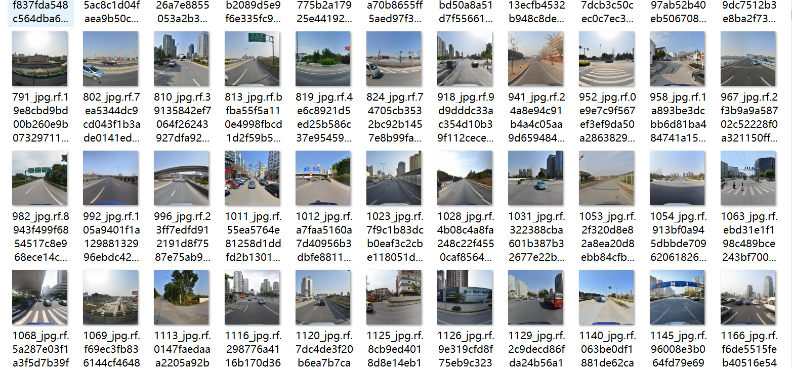

# 基于yolov11的45种交通标志检测与识别系统python源码+pytorch模型+评估指标曲线+精美GUI界面

【算法介绍】

基于YOLOv11的45种交通标志检测与识别系统，是专为智能交通与自动驾驶领域设计的深度学习解决方案。该系统利用YOLOv11目标检测算法的最新优势，实现对45类常见交通标志的高效、精准识别，包括限速牌、停车标志、禁止通行等。

系统核心采用YOLOv11模型，其网络结构通过C3k2块、SPPF模块及C2PSA注意力机制的优化，显著提升了特征提取能力与空间注意力，尤其在复杂场景下对小目标和重叠目标的检测精度显著提升。在数据层面，系统基于TT100K等公开数据集进行训练，结合旋转、缩放、翻转等数据增强技术，确保模型在多场景、多光照条件下的泛化能力。

系统架构包含三大模块：图像输入、摄像头实时检测和视频文件读取；检测与识别模块通过YOLOv11实现交通标志的快速定位与分类；结果输出模块在图像上绘制检测框并标注类别信息。

该系统可广泛应用于车载辅助驾驶、交通监控及智能导航系统，通过提升道路标志识别准确率，有效降低交通事故风险，推动智能交通技术的落地应用。

【效果展示】

<div style="text-align:center;"></div>

<div style="text-align:center;">&nbsp;</div>

【训练数据集介绍】
数据集格式：YOLO格式(仅仅包含jpg图片以及对应的yolo格式txt文件，已划分好训练验证测试集)
图片数量(jpg文件个数)：9720
标注数量(xml文件个数)：9720
标注数量(txt文件个数)：9720
标注类别数：45
标注类别名称(注意yolo格式类别顺序不和这个对应，而以提供data.yaml类别顺序为准):["i2","i2r","i4","i4l","i5","il60","il80","il100","ip","p3","p5","p6","p10","p11","p12","p13","p19","p23","p26","p27","pg","ph4","ph4.5","ph5","pl5","pl20","pl30","pl40","pl50","pl60","pl70","pl80","pl100","pl120","pm20","pm30","pm55","pn","pne","pr40","w13","w32","w55","w57","w59"]
每个类别标注的框数：
i2 框数 = 471
i2r 框数 = 429
i4 框数 = 812
i4l 框数 = 335
i5 框数 = 1734
il60 框数 = 132
il80 框数 = 488
il100 框数 = 296
ip 框数 = 354
p3 框数 = 374
p5 框数 = 1580
p6 框数 = 189
p10 框数 = 379
p11 框数 = 128
p12 框数 = 296
p13 框数 = 839
p19 框数 = 134
p23 框数 = 173
p26 框数 = 421
p27 框数 = 116
pg 框数 = 157
ph4 框数 = 121
ph4.5 框数 = 186
ph5 框数 = 121
pl5 框数 = 670
pl20 框数 = 298
pl30 框数 = 164
pl40 框数 = 639
pl50 框数 = 1409
pl60 框数 = 537
pl70 框数 = 1071
pl80 框数 = 834
pl100 框数 = 148
pl120 框数 = 901
pm20 框数 = 156
pm30 框数 = 106
pm55 框数 = 139
pn 框数 = 3172
pne 框数 = 2383
pr40 框数 = 201
w13 框数 = 130
w32 框数 = 123
w55 框数 = 179
w57 框数 = 418
w59 框数 = 231
总框数：24174
使用标注工具：labelImg
标注规则：对类别进行画矩形框
重要说明：暂无
特别声明：本数据集不对训练的模型或者权重文件精度作任何保证，数据集只提供准确且合理标注

图片预览：

 

【训练信息】

| 参数 | 值 |
|:---:|:---:|
| 训练集图片数 | 6793 |
| 验证集图片数 | 1931 |
| 训练map | 64.3% |
| 训练精度(Precision) | 68.4% |
| 训练召回率(Recall) | 58.5% |

【验证集精度统计】

| Class | Images | Instances | P | R | mAP50 | mAP50-95 |
|:---:|:---:|:---:|:---:|:---:|:---:|:---:|
| all | 1931 | 4797 | 0.684 | 0.585 | 0.643 | 0.459 |
| i2 | 87 | 87 | 0.72 | 0.649 | 0.756 | 0.472 |
| i2r | 91 | 91 | 0.781 | 0.681 | 0.754 | 0.513 |
| i4 | 154 | 164 | 0.833 | 0.67 | 0.788 | 0.493 |
| i4l | 73 | 74 | 0.82 | 0.676 | 0.774 | 0.537 |
| i5 | 325 | 346 | 0.91 | 0.761 | 0.879 | 0.558 |
| il60 | 69 | 91 | 0.819 | 0.894 | 0.919 | 0.7 |
| il80 | 53 | 59 | 0.707 | 0.859 | 0.872 | 0.663 |
| il100 | 28 | 28 | 0.831 | 0.703 | 0.88 | 0.664 |
| ip | 60 | 70 | 0.731 | 0.543 | 0.65 | 0.318 |
| p3 | 30 | 30 | 0.82 | 0.6 | 0.697 | 0.522 |
| p5 | 76 | 79 | 0.765 | 0.646 | 0.703 | 0.523 |
| p6 | 23 | 23 | 0.563 | 0.392 | 0.513 | 0.447 |
| p10 | 69 | 71 | 0.579 | 0.577 | 0.574 | 0.44 |
| p11 | 313 | 315 | 0.749 | 0.622 | 0.713 | 0.459 |
| p12 | 36 | 36 | 0.489 | 0.389 | 0.331 | 0.255 |
| p13 | 52 | 82 | 0.664 | 0.598 | 0.634 | 0.379 |
| p19 | 24 | 24 | 0.539 | 0.487 | 0.508 | 0.409 |
| p23 | 60 | 61 | 0.734 | 0.574 | 0.668 | 0.493 |
| p26 | 163 | 172 | 0.685 | 0.616 | 0.692 | 0.499 |
| p27 | 29 | 29 | 0.425 | 0.379 | 0.368 | 0.282 |
| pg | 29 | 29 | 0.954 | 0.621 | 0.756 | 0.523 |
| ph4 | 22 | 23 | 0.67 | 0.529 | 0.584 | 0.454 |
| ph4.5 | 31 | 35 | 0.694 | 0.713 | 0.693 | 0.542 |
| ph5 | 21 | 24 | 0.439 | 0.208 | 0.294 | 0.198 |
| pl5 | 75 | 110 | 0.657 | 0.473 | 0.533 | 0.336 |
| pl20 | 31 | 33 | 0.598 | 0.0904 | 0.202 | 0.138 |
| pl30 | 122 | 124 | 0.606 | 0.5 | 0.55 | 0.413 |
| pl40 | 277 | 286 | 0.69 | 0.476 | 0.611 | 0.421 |
| pl50 | 209 | 210 | 0.579 | 0.471 | 0.527 | 0.377 |
| pl60 | 170 | 174 | 0.526 | 0.575 | 0.564 | 0.441 |
| pl70 | 28 | 28 | 0.696 | 0.573 | 0.597 | 0.478 |
| pl80 | 158 | 165 | 0.713 | 0.661 | 0.713 | 0.52 |
| pl100 | 76 | 131 | 0.813 | 0.797 | 0.883 | 0.689 |
| pl120 | 47 | 59 | 0.679 | 0.79 | 0.781 | 0.607 |
| pm20 | 26 | 26 | 0.629 | 0.538 | 0.66 | 0.498 |
| pm30 | 17 | 17 | 0.251 | 0.412 | 0.252 | 0.217 |
| pm55 | 31 | 32 | 0.662 | 0.675 | 0.72 | 0.583 |
| pn | 603 | 633 | 0.901 | 0.736 | 0.829 | 0.526 |
| pne | 429 | 471 | 0.92 | 0.779 | 0.876 | 0.537 |
| pr40 | 37 | 37 | 0.82 | 0.892 | 0.945 | 0.785 |
| w13 | 27 | 27 | 0.455 | 0.333 | 0.354 | 0.242 |
| w32 | 23 | 23 | 0.678 | 0.261 | 0.349 | 0.175 |
| w55 | 43 | 43 | 0.531 | 0.512 | 0.513 | 0.364 |
| w57 | 77 | 82 | 0.648 | 0.718 | 0.737 | 0.514 |
| w59 | 43 | 43 | 0.803 | 0.663 | 0.742 | 0.455 |

【测试环境】

windows10
anaconda3+python3.8
torch==2.3.1
ultralytics==8.3.120
onnxruntime==1.16.3

【界面设计】

```
class Ui_MainWindow(QtWidgets.QMainWindow):
    signal = QtCore.pyqtSignal(str, str)
 
    def setupUi(self):
        self.setObjectName("MainWindow")
        self.resize(1280, 728)
        self.centralwidget = QtWidgets.QWidget(self)
        self.centralwidget.setObjectName("centralwidget")
 
        self.weights_dir = './weights'
 
        self.picture = QtWidgets.QLabel(self.centralwidget)
        self.picture.setGeometry(QtCore.QRect(260, 10, 1010, 630))
        self.picture.setStyleSheet("background:black")
        self.picture.setObjectName("picture")
        self.picture.setScaledContents(True)
        self.label_2 = QtWidgets.QLabel(self.centralwidget)
        self.label_2.setGeometry(QtCore.QRect(10, 10, 81, 21))
        self.label_2.setObjectName("label_2")
        self.cb_weights = QtWidgets.QComboBox(self.centralwidget)
        self.cb_weights.setGeometry(QtCore.QRect(10, 40, 241, 21))
        self.cb_weights.setObjectName("cb_weights")
        self.cb_weights.currentIndexChanged.connect(self.cb_weights_changed)
 
        self.label_3 = QtWidgets.QLabel(self.centralwidget)
        self.label_3.setGeometry(QtCore.QRect(10, 70, 72, 21))
        self.label_3.setObjectName("label_3")
        self.hs_conf = QtWidgets.QSlider(self.centralwidget)
        self.hs_conf.setGeometry(QtCore.QRect(10, 100, 181, 22))
        self.hs_conf.setProperty("value", 25)
        self.hs_conf.setOrientation(QtCore.Qt.Horizontal)
        self.hs_conf.setObjectName("hs_conf")
        self.hs_conf.valueChanged.connect(self.conf_change)
        self.dsb_conf = QtWidgets.QDoubleSpinBox(self.centralwidget)
        self.dsb_conf.setGeometry(QtCore.QRect(200, 100, 51, 22))
        self.dsb_conf.setMaximum(1.0)
        self.dsb_conf.setSingleStep(0.01)
        self.dsb_conf.setProperty("value", 0.25)
        self.dsb_conf.setObjectName("dsb_conf")
        self.dsb_conf.valueChanged.connect(self.dsb_conf_change)
        self.dsb_iou = QtWidgets.QDoubleSpinBox(self.centralwidget)
        self.dsb_iou.setGeometry(QtCore.QRect(200, 160, 51, 22))
        self.dsb_iou.setMaximum(1.0)
        self.dsb_iou.setSingleStep(0.01)
        self.dsb_iou.setProperty("value", 0.45)
        self.dsb_iou.setObjectName("dsb_iou")
        self.dsb_iou.valueChanged.connect(self.dsb_iou_change)
        self.hs_iou = QtWidgets.QSlider(self.centralwidget)
        self.hs_iou.setGeometry(QtCore.QRect(10, 160, 181, 22))
        self.hs_iou.setProperty("value", 45)
        self.hs_iou.setOrientation(QtCore.Qt.Horizontal)
        self.hs_iou.setObjectName("hs_iou")
        self.hs_iou.valueChanged.connect(self.iou_change)
        self.label_4 = QtWidgets.QLabel(self.centralwidget)
        self.label_4.setGeometry(QtCore.QRect(10, 130, 72, 21))
        self.label_4.setObjectName("label_4")
        self.label_5 = QtWidgets.QLabel(self.centralwidget)
        self.label_5.setGeometry(QtCore.QRect(10, 210, 72, 21))
        self.label_5.setObjectName("label_5")
        self.le_res = QtWidgets.QTextEdit(self.centralwidget)
        self.le_res.setGeometry(QtCore.QRect(10, 240, 241, 400))
        self.le_res.setObjectName("le_res")
        self.setCentralWidget(self.centralwidget)
        self.menubar = QtWidgets.QMenuBar(self)
        self.menubar.setGeometry(QtCore.QRect(0, 0, 1110, 30))
        self.menubar.setObjectName("menubar")
        self.setMenuBar(self.menubar)
        self.statusbar = QtWidgets.QStatusBar(self)
        self.statusbar.setObjectName("statusbar")
        self.setStatusBar(self.statusbar)
        self.toolBar = QtWidgets.QToolBar(self)
        self.toolBar.setToolButtonStyle(QtCore.Qt.ToolButtonTextBesideIcon)
        self.toolBar.setObjectName("toolBar")
        self.addToolBar(QtCore.Qt.TopToolBarArea, self.toolBar)
        self.actionopenpic = QtWidgets.QAction(self)
        icon = QtGui.QIcon()
        icon.addPixmap(QtGui.QPixmap(":/images/1.png"), QtGui.QIcon.Normal, QtGui.QIcon.Off)
        self.actionopenpic.setIcon(icon)
        self.actionopenpic.setObjectName("actionopenpic")
        self.actionopenpic.triggered.connect(self.open_image)
        self.action = QtWidgets.QAction(self)
        icon1 = QtGui.QIcon()
        icon1.addPixmap(QtGui.QPixmap(":/images/2.png"), QtGui.QIcon.Normal, QtGui.QIcon.Off)
        self.action.setIcon(icon1)
        self.action.setObjectName("action")
        self.action.triggered.connect(self.open_video)
        self.action_2 = QtWidgets.QAction(self)
        icon2 = QtGui.QIcon()
        icon2.addPixmap(QtGui.QPixmap(":/images/3.png"), QtGui.QIcon.Normal, QtGui.QIcon.Off)
        self.action_2.setIcon(icon2)
        self.action_2.setObjectName("action_2")
        self.action_2.triggered.connect(self.open_camera)
 
        self.actionexit = QtWidgets.QAction(self)
        icon3 = QtGui.QIcon()
        icon3.addPixmap(QtGui.QPixmap(":/images/4.png"), QtGui.QIcon.Normal, QtGui.QIcon.Off)
        self.actionexit.setIcon(icon3)
        self.actionexit.setObjectName("actionexit")
        self.actionexit.triggered.connect(self.exit)
 
        self.toolBar.addAction(self.actionopenpic)
        self.toolBar.addAction(self.action)
        self.toolBar.addAction(self.action_2)
        self.toolBar.addAction(self.actionexit)
 
        self.retranslateUi()
        QtCore.QMetaObject.connectSlotsByName(self)
        self.init_all()
```

【模型可检测出45类】

```
names:
- i2
- i2r
- i4
- i4l
- i5
- il100
- il60
- il80
- ip
- p10
- p11
- p12
- p13
- p19
- p23
- p26
- p27
- p3
- p5
- p6
- pg
- ph4
- ph4.5
- ph5
- pl100
- pl120
- pl20
- pl30
- pl40
- pl5
- pl50
- pl60
- pl70
- pl80
- pm20
- pm30
- pm55
- pn
- pne
- pr40
- w13
- w32
- w55
- w57
- w59
nc: 45
test: ../test/images
train: ../train/images
val: ../valid/images
```

【常用评估参数介绍】

在目标检测任务中，评估模型的性能是至关重要的。你提到的几个术语是评估模型性能的常用指标。下面是对这些术语的详细解释：

1.  **Class** ：

   - 这通常指的是模型被设计用来检测的目标类别。例如，一个模型可能被训练来检测车辆、行人或动物等不同类别的对象。

2.  **Images** ：

   - 表示验证集中的图片数量。验证集是用来评估模型性能的数据集，与训练集分开，以确保评估结果的公正性。

3.  **Instances** ：

   - 在所有图片中目标对象的总数。这包括了所有类别对象的总和，例如，如果验证集包含100张图片，每张图片平均有5个目标对象，则Instances为500。

4.  **P（精确度Precision）** ：

   - 精确度是模型预测为正样本的实例中，真正为正样本的比例。计算公式为：Precision = TP / (TP + FP)，其中TP表示真正例（True Positives），FP表示假正例（False Positives）。

5.  **R（召回率Recall）** ：

   - 召回率是所有真正的正样本中被模型正确预测为正样本的比例。计算公式为：Recall = TP / (TP + FN)，其中FN表示假负例（False Negatives）。

6.  **mAP50** ：

   - 表示在IoU（交并比）阈值为0.5时的平均精度（mean Average Precision）。IoU是衡量预测框和真实框重叠程度的指标。mAP是一个综合指标，考虑了精确度和召回率，用于评估模型在不同召回率水平上的性能。在IoU=0.5时，如果预测框与真实框的重叠程度达到或超过50%，则认为该预测是正确的。

7.  **mAP50-95** ：

   - 表示在IoU从0.5到0.95（间隔0.05）的范围内，模型的平均精度。这是一个更严格的评估标准，要求预测框与真实框的重叠程度更高。在目标检测任务中，更高的IoU阈值意味着模型需要更准确地定位目标对象。mAP50-95的计算考虑了从宽松到严格的多个IoU阈值，因此能够更全面地评估模型的性能。

这些指标共同构成了评估目标检测模型性能的重要框架。通过比较不同模型在这些指标上的表现，可以判断哪个模型在实际应用中可能更有效。

【使用步骤】

使用步骤：
（1）首先根据官方框架ultralytics安装教程安装好yolov11环境，并安装好pyqt5
（2）切换到自己安装的yolo11环境后，并切换到源码目录，执行python main.py即可运行启动界面，进行相应的操作即可

【提供文件】

python源码
yolo11n.pt模型
训练的map,P,R曲线图(在weights\results.png)
测试图片（在test_img文件夹下面）

注意提供训练的数据集，请到mytxt.txt文件中找到地址
<br>项目源码地址：https://mbd.pub/o/bread/YZWUl5tqaQ==
